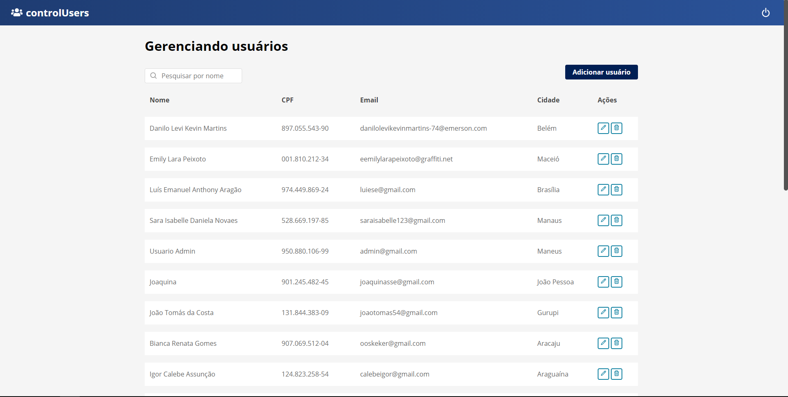
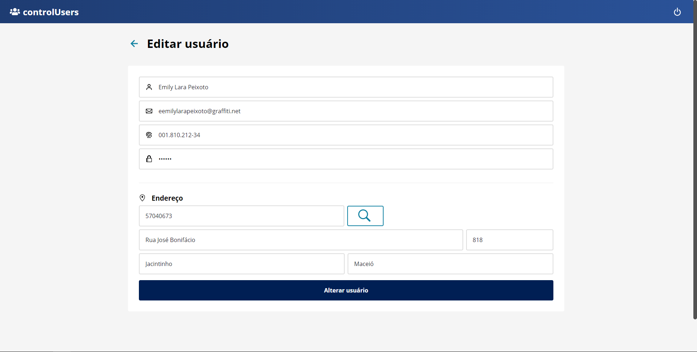

<h1 align="center">controlUsers</h1>
<h3 align="center">⚡ A CRUD of Users ⚡</h3>
<br />

## Screenshots
<p align="center">
  
  
  
</p>


<!-- ## About
<p align="left">
   This project was developed during the Rocketseat Bootcamp. Where I learned in practice Redux, Redux Saga and other technologies.
</p> -->

<br />

## How to run 🔥

```bash
# Clone this repository
$ git clone https://github.com/hrammos/controlUsers.git

# Go into the repository
$ cd controlUsers

# Install dependencies
$ yarn install

# Run server
$ yarn server

# Run web application
$ yarn start
```
###### *This project runs with a fake API, from [json-server](https://github.com/typicode/json-server).*

<br />

-------
#### By [Henrique Ramos](https://www.linkedin.com/in/henriqueoramos) 👋
